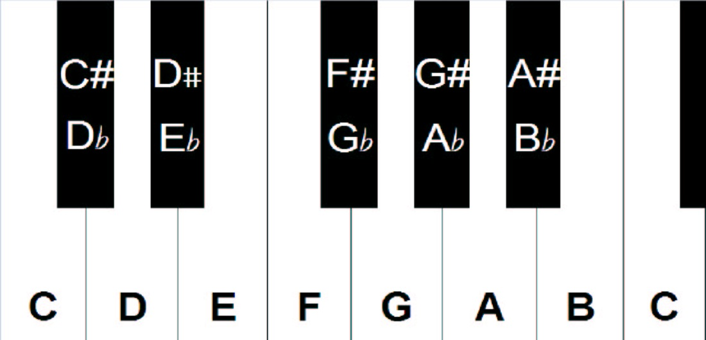

# Keyboard Prodigy

**Programming – Hard – Problem #433**

`https://ctflearn.com/challenge/433`


## Description

Nozart just got a new keyboard and became obsessed with music! He has been
playing for hours and played many sequences of notes, and after reading a book
on music theory, he wants to count how many times he played the keys of a major
scale.

Here is an excerpt from Nozart's music book:

> In order to count how many times Nozart played the keys of a major scale, we
> need to learn a bit about music theory.
>
> A keyboard (or piano) is composed of a series of the same notes, called
> octaves.
>
> 
>
> This picture shows all of the notes in an octave. When moving from one key to
> the one directly to the right of it, whether it is black or white, the
> distance between two adjacent notes is called a semitone. One octave starts
> and ends on the same note, a distance of 12 semitones (6 tones).
>
> Each note has a letter between A-G that describes its sound. Adding a sharp
> sign (#) increases the note by one semitone, and a flat (b) decreases it by
> one semitone. A major scale is comprised of 8 notes in a sequence. The
> distance between these notes follows the pattern: tone, tone, semitone, tone,
> tone, tone, semitone
>
> Each line in the input represents a sequence of 8 notes that Nozart plays. We
> have to determine whether or not these notes make up a valid major scale.
> Let's say one sequence of notes is this:
>
> ```text
> C D E F G A B C
> ```
>
> This is a valid scale because if you reference the picture, the distances
> between notes follows the major scale pattern. The input may not necessarily
> give you these notes in order, and it may substitute notes with flats or
> sharps with the same value. Here is a shuffled version of the above example:
>
> ```text
> F G A C E C D B
> ```
>
> The following is an example of same-value substitutions (# is one semitone
> higher, b is one semitone lower):
>
> ```text
> E# G A B# Fb B# D Cb
> ```
>
> Now go find out if Nozart really can become a ♬usica♩ prod♪gy!
>
> **Additional Test Cases**
>
> Valid Sequences:
>
> ```text
> E#  G#  B   Gb  D#  Db  Gb  Bb
> F   Bb  Eb  G   G#  C   Db  Ab
> Fb  Ab  C#  Bb  D#  B   Gb  Cb
> G   E#  A   B#  Bb  Eb  D   A#
> G#  B#  G   F   C#  Ab  Bb  Eb
> ```
>
> Invalid Sequences:
>
> ```text
> A   G   F#  G   B#  Gb  Gb  Ab
> Eb  D   G   A#  E#  Gb  Bb  A
> D#  C#  D   B   Bb  Cb  Eb  E#
> Ab  Fb  D   F   Eb  Bb  G   D#
> C   G#  Cb  G#  E#  C   D   A#
> ```


The note sequences he played (your input) are [found here](./extra/input.txt).

Is Nozart really a prodigy? How many times did he play the keys of a major
scale?
