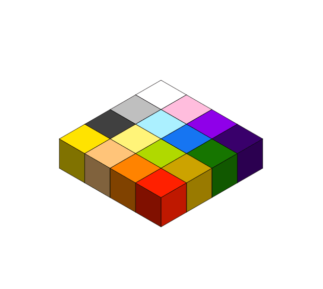

# Q's Cubes

**Miscellaneous – Hard – Problem #437**

`https://ctflearn.com/challenge/437`


## Description

For Christmas, Q received an enormous set of cubes with letters and numbers on
them.

He decided that rearranging these cubes in a certain way would let him hide a
secret message.

The way he rearranges them is by folding all of them in half, over and over,
until they form a single pillar. This is explained in more detail below.

Q leaves us this aerial view (your input) of his cubes
[here](./extra/input.txt). What message was Q trying to convey? *Hint*: Q has
been playing Baseball for 16 years.

> Q gives us his cubes arranged as a flat square on the ground. By folding the
> cubes over each other, North to South, and West to East, a pillar of cubes is
> eventually formed. Reading the letters and numbers on this pillar from top to
> bottom is the message that Q wants us to find.
>
> Q's cubes are given from an aerial point of view:
>
> ```txt
> ABCD
> EFGH
> IJKL
> MNOP
> ```
>
> This is very easy to understand if you can visualize it, so try to understand
> it visually first, then conceptually.
>
> 
>
> This is the aerial view of our starting 4x4 grid. Compare this to the 3D view
> so that you understand how the puzzle is given to us initially.
>
> 
>
> This is the 3D version of our starting 4x4 grid of cubes. Think of each letter
> that is given in the example as a separate color. You can see how they move
> after each fold.
>
> 
>
> The first fold is from top to bottom. The top two rows fold over the middle,
> and now our cubes look like the above illustration.
>
> 
>
> The next fold is from left to right. We take the 2x2 block on the left and
> flip it over and on top of the right 2x2 block. The result is a 2x2x4
> structure which looks like the one above.
>
> 
>
> The next fold is top to bottom once again. We took the back 2x4 and flipped it
> over on the front, so it lays on top and becomes part of the resulting 2x1x8.
>
> 
>
> The final fold would take the left pillar and place it upside down on the
> right pillar. Because of the limitations of the website I used to make these
> diagrams, I couldn't actually fit 16 cubes on top of each other. The above
> diagram is just the one before it split in half. After flipping the left
> pillar onto the right, we would have our final pillar. Q's message is read
> from top to bottom on the final pillar. In this case, we would read from
> orange to green (left pillar), followed by light orange to red (right pillar).
>
> As you can see, the folds start from top to bottom, then left to right, and
> alternate until we have our final pillar. In our example, the message would be
> read as: `OCBNJFGKLHEIMADP`
>
> Remember, Q's cubes have both letters and numbers on them, so they may not
> necessarily have only letters.
>
> **Additional Test Cases**:
>
> ```text
> 2x2 Grid of Cubes
> -----------------
> 12
> 34
>
> Output: 3124
> ```
>
> ```text
> 8x8 Grid of Cubes
> -----------------
> ABCDEFGH
> IJKLMNOP
> QRSTUVWX
> YZabcdef
> ghijklmn
> opqrstuv
> wxyz0123
> 456789?!
>
> Output: ?GB5hZemldai6CF91NKyqSVtuWRpxJO23PIwoQXvsUTrzLM08ED7jbcknfYg4AH!
> ```
