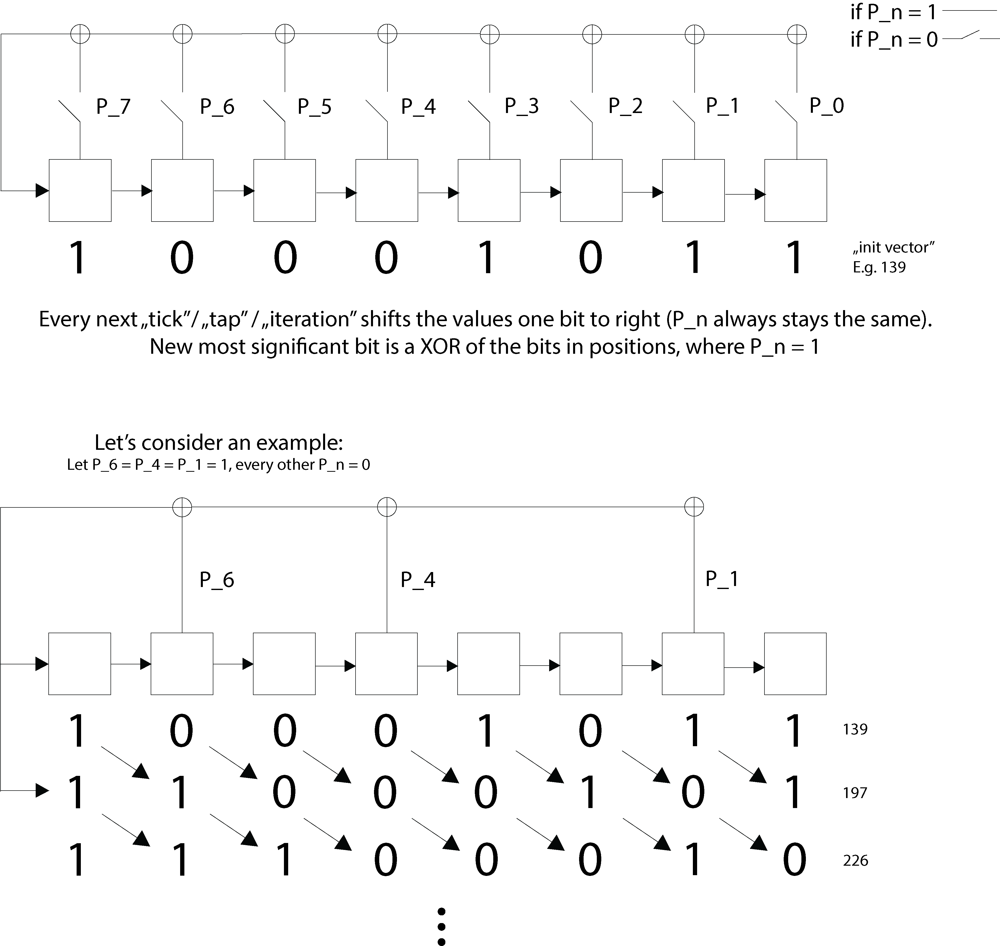

# Linear-Feedback. Shift. Register.

**Cryptography – Hard – Problem #1059**

`https://ctflearn.com/challenge/1059`

## Description

Hello!

I have just implemented a super-cool PRNG!

I've used every next generated by it number to XOR every next character in
[my super-secret message](./extra/message.dat) with.

Are you able to retrieve it?

Btw. Biggest possibly generated number by my PRNG is 255.

Psst. The retrieved message would be your flag!

As always, starting with: `CTFlearn{...`

